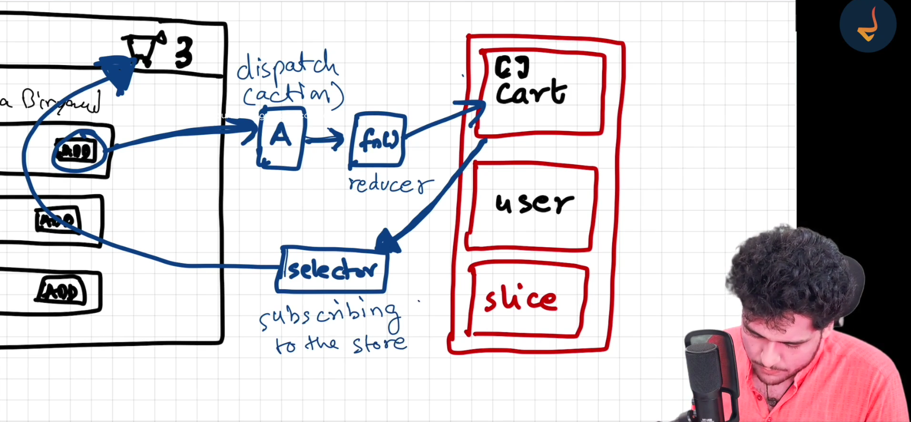

### Redux - Why , when and how.

Redux is primarily used to manage **state** in JavaScript applications, especially when they grow in complexity. Here’s a breakdown to help you understand why Redux is needed and when to use it.

### Why Redux is Needed:
1. **Single Source of Truth:** In larger applications, keeping track of state across components becomes hard. Redux provides a single, centralized store for the entire app.
2. **Predictability:** Since Redux state changes only through **pure functions** (reducers), it ensures that the state transitions are predictable.
3. **Easier Debugging:** Redux’s unidirectional data flow makes it simpler to trace bugs and reproduce errors by viewing the state history.
4. **Time-Travel Debugging:** With tools like Redux DevTools, you can inspect every state change and even step back in time to previous states.
5. **Scalable State Management:** As your application grows, passing props across deeply nested components becomes cumbersome. Redux solves this by giving any component direct access to the global state.

---

### Lifecycle in Redux:
1. **Store Initialization:**
   - A Redux store is created using `createStore()` from Redux, holding the entire state tree of the application.

2. **Action Dispatching:**
   - When an event occurs (like a button click), an **action** is dispatched. An action is a plain JavaScript object that describes what happened (e.g., `{ type: 'INCREMENT' }`).

3. **Reducer Invocation:**
   - The **reducer** is a pure function that takes the current state and the dispatched action to return a new state. It updates the store accordingly.

4. **State Update:**
   - The updated state is now available throughout the application. Components subscribed to the store will re-render accordingly.

---

### When to Use Redux:
1. **Complex State Logic:** If your app requires shared state (e.g., authentication status, shopping cart).
2. **Frequent Updates from Different Sources:** For example, a live dashboard with multiple data sources.
3. **Global State:** Use Redux when many components in the app need access to the same data (e.g., user preferences, themes).
4. **Time-Travel Debugging Needs:** Ideal when you want to log all state transitions for auditing purposes.
5. **Avoid Prop Drilling:** When passing state down multiple levels of the component tree becomes cumbersome.

---

### When **Not** to Use Redux:
1. **Small Apps:** If the state management is simple, such as with a small to-do list, using React’s `useState` or `useContext` might be more appropriate.
2. **Simple Forms:** Redux can be overkill for managing form input states unless you’re building something complex like a multi-step form wizard.

---

To summarize, Redux shines when you need **scalable, predictable, and maintainable state management** across large applications. But for simpler applications, built-in React hooks like `useState` or `useReducer` might suffice.