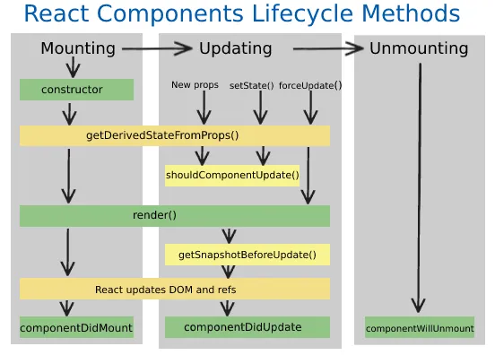

## Day -1 of learning React.

### How does UseEffect works.

```js
    useEffect(()=>{
        console.log("useEffect Called");
    } , []); // Everytime 

```


### LifeCycle of react-component.
- How this component is mounted.


- counstructor() -> render() -> componentDidMount().





### How does the hierarchy works?

-- Parent constructor
-- Parent Render
-- Child1 Constructor 
-- Child1 Render
-- Child 2 Constructor

### Methods of React.component class


1. constructor() -> render() -> componentDidMount -> componentDidUpdate() -> ComponentWillUnmount.


###
- componentDidMount is the best time to make API calls (yk why? ) exactly why we use useEffect to call API's.


### Why componentwillUnmount()
- to cleanUP the mess.


